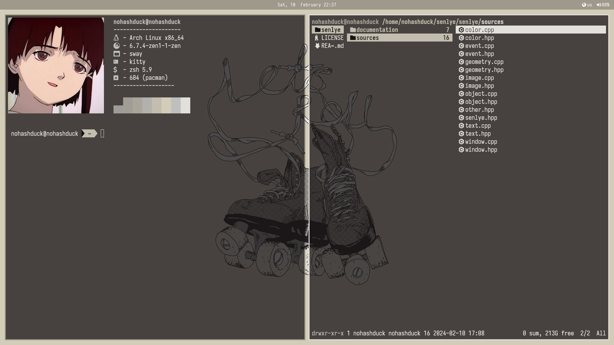

[](./readme.md)

## Overview
Dotfiles is my personal dotfiles configuration for various programs and tools. 

## Installation
The initial installation of `nohashduck/dotfiles` can be done by typing the following chain of commands.
```bash
git clone https://github.com/nohashduck/dotfiles.git
```
If you want to do all of this at once, we can chain the commands like so:
```bash
git clone https://github.com/nohashduck/dotfiles.git
```
